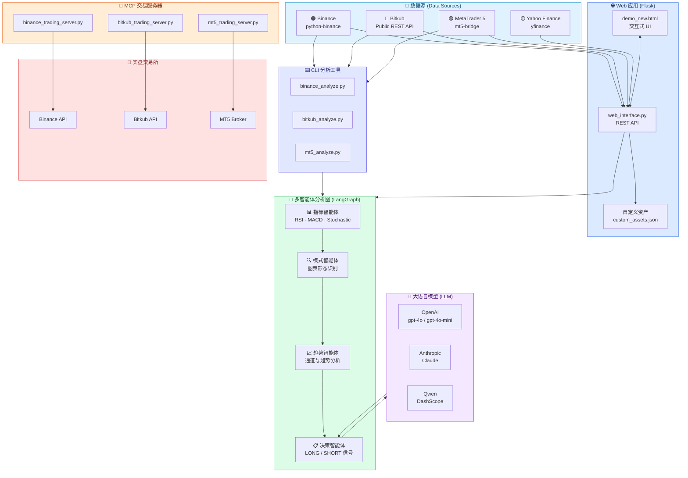

<div align="center">


<h2>QuantAgent: 基于价格驱动的多智能体大语言模型高频交易系统</h2>

</div>


<div align="center">

<div style="position: relative; text-align: center; margin: 20px 0;">
  <div style="position: absolute; top: -10px; right: 20%; font-size: 1.2em;"></div>
  <p>
    <a href="https://machineily.github.io/">Fei Xiong</a><sup>1,2 ★</sup>&nbsp;
    <a href="https://wyattz23.github.io">Xiang Zhang</a><sup>3 ★</sup>&nbsp;
    <a href="https://scholar.google.com/citations?user=hFhhrmgAAAAJ&hl=en">Aosong Feng</a><sup>4</sup>&nbsp;
    <a href="https://intersun.github.io/">Siqi Sun</a><sup>5</sup>&nbsp;
    <a href="https://chenyuyou.me/">Chenyu You</a><sup>1</sup>
  </p>
  
  <p>
    <sup>1</sup> Stony Brook University &nbsp;&nbsp; 
    <sup>2</sup> Carnegie Mellon University &nbsp;&nbsp;
    <sup>3</sup> University of British Columbia &nbsp;&nbsp; <br>
    <sup>4</sup> Yale University &nbsp;&nbsp; 
    <sup>5</sup> Fudan University &nbsp;&nbsp; 
    ★ Equal Contribution <br>
  </p>
</div>

<div align="center" style="margin: 20px 0;">
  <a href="README.md">English</a> | <a href="README_CN.md">中文</a> | <a href="README_TH.md">ภาษาไทย</a>
</div>

<br>

<p align="center">
  <a href="https://arxiv.org/abs/2509.09995">
    
  </a>
  <a href="https://Y-Research-SBU.github.io/QuantAgent">
    
  </a>
  <a href="https://github.com/Y-Research-SBU/QuantAgent/blob/main/assets/wechat_0203.jpg">
    
  </a>
  <a href="https://discord.gg/t9nQ6VXQ">
    
  </a>
</p>

</div>

一个复杂的多智能体交易分析系统，结合了技术指标、模式识别和趋势分析，使用 LangChain 和 LangGraph。该系统提供网络界面和程序化访问，用于全面的市场分析。

<div align="center">

🚀 [功能特性](#-功能特性) | ⚡ [安装](#-安装) | 🎬 [使用](#-使用) | 🔧 [实现细节](#-实现细节) | 🤝 [贡献](#-贡献) | 📄 [许可证](#-许可证)

</div>

## 🗺️ 架构总览 (Architecture Overview)



## 🚀 功能特性

### 指标智能体

• 计算一套技术指标——包括用于评估动量极值的 RSI、用于量化收敛-发散动态的 MACD，以及用于测量收盘价相对于最近交易范围的随机振荡器——在每个传入的 K 线上，将原始 OHLC 数据转换为精确的、信号就绪的指标。


  
### 模式智能体

• 在模式查询时，模式智能体首先绘制最近的价格图表，识别其主要高点、低点和总体上升或下降走势，将该形状与一组熟悉的模式进行比较，并返回最佳匹配的简短、通俗语言描述。


  
### 趋势智能体

• 利用工具生成的带注释的 K 线图表，叠加拟合的趋势通道——追踪最近高点和低点的上下边界线——来量化市场方向、通道斜率和盘整区域，然后提供当前趋势的简洁、专业的总结。


### 决策智能体

• 综合指标、模式、趋势和风险智能体的输出——包括动量指标、检测到的图表形态、通道分析和风险-回报评估——制定可操作的交易指令，明确指定做多或做空头寸、推荐的入场和出场点、止损阈值，以及基于每个智能体发现的简洁理由。


### 网络界面
基于 Flask 的现代网络应用程序，具有：
  - 来自多数据源（Yahoo Finance、MetaTrader 5、Binance、Bitkub）的实时市场数据
  - 交互式资产选择（股票、加密货币、商品、外汇等）
  - 灵活定制化时间刻度（支持切换成指定日期范围或提取最近的 K线 Bars）
  - 多时间框架分析（1分钟到1天）
  - 动态图表生成及统一操作界面
  - API 密钥管理以及根据不同数据源管理自定义资产配置的功能

### 🤖 AI 交易代理 (MCP)
系统现配有 **Model Context Protocol (MCP)** 服务器，允许外部 AI 代理或桌面应用程序直接自主执行交易逻辑和操作策略：
- **`mcp_servers/mt5_trading_server.py`**: MT5 自动化交易（需预装 `mt5-bridge` 服务器）。
- **`mcp_servers/binance_trading_server.py`**: 币安 (Binance) 现货与 USDS-M 合约交易。
- **`mcp_servers/bitkub_trading_server.py`**: Bitkub 现货交易（基于 HMAC-SHA256 安全验证）。

这些服务器开放了标准化的工具集，允许类似于 LLMs 的 AI 来直接查询余额、获取未平仓订单及挂单与平仓等。

## 📦 安装

### 1. 创建并激活 Conda 环境

```bash
conda create -n quantagents python=3.11
conda activate quantagents
```

### 2. 安装依赖

```bash
pip install -r requirements.txt
# 目前新增了支持多交易所与MCP代理的扩展模块：
pip install python-binance pandas requests flask yfinance mcp
```

如果您遇到 TA-lib-python 的问题，请尝试：

```bash
conda install -c conda-forge ta-lib
```

或访问 [TA-Lib Python 仓库](https://github.com/ta-lib/ta-lib-python) 获取详细的安装说明。

### 3. 设置 LLM API 密钥
您可以在我们的网络界面中稍后设置它，


或将其设置为环境变量：
```bash
# For OpenAI
export OPENAI_API_KEY="your_openai_api_key_here"

# For Anthropic (Claude)
export ANTHROPIC_API_KEY="your_anthropic_api_key_here"

# For Qwen (DashScope)
export DASHSCOPE_API_KEY="your_dashscope_api_key_here"

# 交易所相关 API 配置（用于 MCP 自动交易或加密数据后端读取）
export BINANCE_API_KEY="your_binance_key"
export BINANCE_API_SECRET="your_binance_secret"
export BITKUB_API_KEY="your_bitkub_key"
export BITKUB_API_SECRET="your_bitkub_secret"

```

## 🔧 实现细节

**重要说明**：我们的模型需要一个可以接受图像输入的 LLM，因为我们的智能体会生成和分析视觉图表以进行模式识别和趋势分析。

### Python 使用

要在代码中使用 QuantAgents，您可以导入 trading_graph 模块并初始化 TradingGraph() 对象。.invoke() 函数将返回全面的分析。您可以运行 web_interface.py，这里也有一个快速示例：

```python
from trading_graph import TradingGraph

# 初始化交易图
trading_graph = TradingGraph()

# 使用您的数据创建初始状态
initial_state = {
    "kline_data": your_dataframe_dict,
    "analysis_results": None,
    "messages": [],
    "time_frame": "4hour",
    "stock_name": "BTC"
}

# 运行分析
final_state = trading_graph.graph.invoke(initial_state)

# 访问结果
print(final_state.get("final_trade_decision"))
print(final_state.get("indicator_report"))
print(final_state.get("pattern_report"))
print(final_state.get("trend_report"))
```

### 多交易所 CLI 分析工具 (命令行使用)

您还可以直接通过终端 / 命令行运行自动化定量分析，而无需启动 Web 服务器。我们为每个数据源专门集成了对应的独立 CLI 脚本，它们均接受标准参数以用于提取指定数量的 K线 (Bars) 或精确的日期段：

```bash
# 币安 (Binance) 现货市场分析器
python binance_analyze.py --symbol BTCUSDT --timeframe 1h --bars 100

# Bitkub 分析器 (泰国本地交易所 API)
python bitkub_analyze.py --symbol BTC_THB --timeframe 4h --start "2025-01-01" --end "2025-01-31"

# MetaTrader 5 分析器 (需预装 mt5-bridge 服务器)
python mt5_analyze.py --symbol XAUUSD --timeframe 15m --bars 200 --output report.json
```

**通用 CLI 参数 (Common CLI Arguments):**
- `--symbol`：交易所专用的交易对或证券代码（必填）。
- `--timeframe`：获取 K线 的时间窗口（例如 `1m`，`15m`，`1h`，`1d`）。
- `--bars`：需要获取的最近 K线 数（当无指定日期限制时生效）。
- `--start` / `--end`：采用精确的日期范围获取数据（格式要求 `YYYY-MM-DD` 或 `YYYY-MM-DD HH:MM`）。
- `--output`：直接将完整的数据和策略报告输出保存至 JSON 格式（选填）。

您还可以调整默认配置以在 web_interface.py 中设置您自己的 LLM 选择或分析参数。

```python
if provider == "anthropic":
    # Set default Claude models if not already set to Anthropic models
    if not analyzer.config["agent_llm_model"].startswith("claude"):
        analyzer.config["agent_llm_model"] = "claude-haiku-4-5-20251001"
    if not analyzer.config["graph_llm_model"].startswith("claude"):
        analyzer.config["graph_llm_model"] = "claude-haiku-4-5-20251001"

elif provider == "qwen":
    # Set default Qwen models if not already set to Qwen models
    if not analyzer.config["agent_llm_model"].startswith("qwen"):
        analyzer.config["agent_llm_model"] = "qwen3-max"
    if not analyzer.config["graph_llm_model"].startswith("qwen"):
        analyzer.config["graph_llm_model"] = "qwen3-vl-plus"
    
else:
    # Set default OpenAI models if not already set to OpenAI models
    if analyzer.config["agent_llm_model"].startswith(("claude", "qwen")):
        analyzer.config["agent_llm_model"] = "gpt-4o-mini"
    if analyzer.config["graph_llm_model"].startswith(("claude", "qwen")):
        analyzer.config["graph_llm_model"] = "gpt-4o"
        
```

对于实时数据，我们建议使用网络界面，因为它通过 yfinance 提供对实时市场数据的访问。系统会自动获取最近 30 个蜡烛图以获得最佳的 LLM 分析准确性。

### 配置选项

系统支持以下配置参数：

- `agent_llm_model`：单个智能体的模型（默认："gpt-4o-mini"）
- `graph_llm_model`：图逻辑和决策制定的模型（默认："gpt-4o"）
- `agent_llm_temperature`：智能体响应的温度（默认：0.1）
- `graph_llm_temperature`：图逻辑的温度（默认：0.1）

**注意**：系统使用默认的令牌限制进行综合分析。不应用人工令牌限制。

您可以在 `default_config.py` 中查看完整的配置列表。


## 🚀 使用

### 启动网络界面

```bash
python web_interface.py
```

网络应用程序将在 `http://127.0.0.1:5000` 可用

### 网络界面功能

1. **资产选择**：从可用的股票、加密货币、商品和指数中选择
2. **时间框架选择**：分析从 1 分钟到每日间隔的数据
3. **日期范围**：为分析选择自定义日期范围
4. **实时分析**：获得带有可视化的全面技术分析
5. **API 密钥管理**：通过界面更新您的 LLM API 密钥

## 📺 演示


## 🤝 贡献

1. Fork 仓库
2. 创建功能分支
3. 进行更改
4. 如果适用，添加测试
5. 提交拉取请求

## 📄 许可证

本项目采用 MIT 许可证 - 详情请参阅 LICENSE 文件。

## 🔖 引用
```
@article{xiong2025quantagent,
  title={QuantAgent: Price-Driven Multi-Agent LLMs for High-Frequency Trading},
  author={Fei Xiong and Xiang Zhang and Aosong Feng and Siqi Sun and Chenyu You},
  journal={arXiv preprint arXiv:2509.09995},
  year={2025}
}

```

## 🙏 致谢

此仓库基于以下库和框架构建：

- [**LangGraph**](https://github.com/langchain-ai/langgraph)
- [**OpenAI**](https://github.com/openai/openai-python)
- [**Anthropic (Claude)**](https://github.com/anthropics/anthropic-sdk-python)
- [**Qwen**](https://github.com/QwenLM/Qwen)
- [**yfinance**](https://github.com/ranaroussi/yfinance)
- [**python-binance**](https://github.com/sammchardy/python-binance)
- [**Bitkub Official API Docs**](https://github.com/bitkub/bitkub-official-api-docs)
- [**MT5 Bridge**](https://github.com/akivajp/mt5-bridge)
- [**MCP**](https://github.com/modelcontextprotocol/python-sdk)
- [**Flask**](https://github.com/pallets/flask)
- [**TechnicalAnalysisAutomation**](https://github.com/neurotrader888/TechnicalAnalysisAutomation/tree/main)
- [**tvdatafeed**](https://github.com/rongardF/tvdatafeed)

## ⚠️ 免责声明

此软件仅供教育和研究目的使用。它不旨在提供财务建议。在做出投资决策之前，请始终进行自己的研究并考虑咨询财务顾问。

## 🐛 故障排除

### 常见问题

1. **TA-Lib 安装**：如果您遇到 TA-Lib 安装问题，请参考[官方仓库](https://github.com/ta-lib/ta-lib-python)获取平台特定的说明。

2. **LLM API 密钥**：确保您的 API 密钥在环境中或通过网络界面正确设置。

3. **数据获取**：系统使用雅虎财经获取数据。某些符号可能不可用或历史数据有限。

4. **内存问题**：对于大型数据集，考虑减少分析窗口或使用较小的时间框架。

### 支持

如果您遇到任何问题，请：

0. 尝试刷新页面，重新通过页面输入LLM API 密钥
1. 检查上面的故障排除部分
2. 查看控制台中的错误消息
3. 确保所有依赖项都正确安装
4. 验证您的 LLM API 密钥有效且有足够的积分

## 📧 联系

如有问题、反馈或合作机会，请联系：

**邮箱**：[chenyu.you@stonybrook.edu](mailto:chenyu.you@stonybrook.edu), [siqisun@fudan.edu.cn](mailto:siqisun@fudan.edu.cn)

## Star History

[](https://www.star-history.com/#Y-Research-SBU/QuantAgent&Date)
